#### Sara Caparrós Torres i Patricia López López (ASIX 2 - Curs 2017/18) ####
# **Part I - INSTAL·LACIÓ SGBD MySQL Percona** #

## ENUNCIAT ##
Partint d'una màquina CentOS 7 minimal proporcionada pel professor realitza la instal·lació d'un SGBD Percona Server mitjançant el gestor de paquets YUM.

## ENLLAÇOS ##
**Percona Server 5.7 Doc**
<http://www.percona.com/doc/percona-server/5.7>

**Instal·lació Percona Server 5.7via YUM Repository**  
<http://www.percona.com/doc/percona-server/5.7/installation/yum_repo.html>

**Instal·lació MySQL via YUM Repository**
<http://www.tecmint.com/install-latest-mysql-on-rhel-centos-and-fedora/>

## **Documentació per la instal·lació** ##
Iniciem sessió:
  

Per instal·lar el repositori de Percona s'ha de posar:  
`yum install http://www.percona.com/downloads/percona-release/redhat/0.1-4/percona-release-0.1-4.noarch.rpm`  
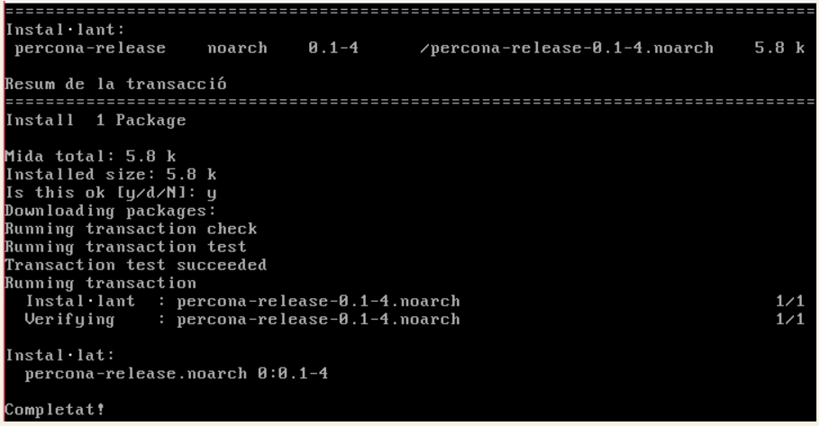  

Per veure si els repositoris estan disponibles fem:  
`yum list | grep percona`  
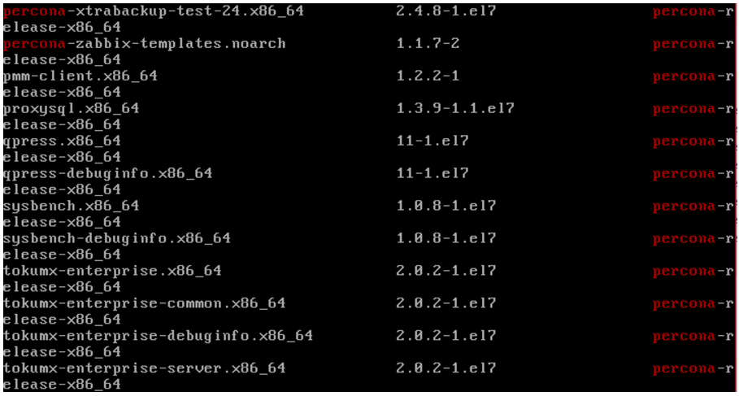  

Per instal·lar el servidor fem:  
`yum install Percona-Server-server-57`  
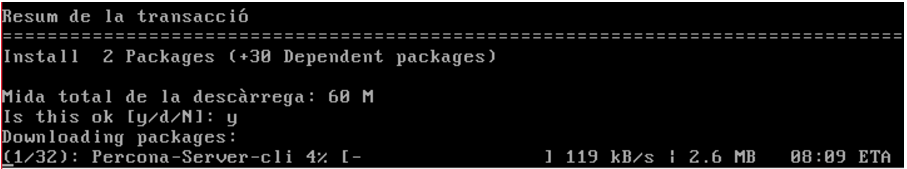  

Un cop instal·lat el servidor Percona, l'iniciem.  
`service mysql start`  

Per descarregar el repositori YUM del MySQL 5.7  
`wget http://dev.mysql.com/get/mysql57-community-release-el7-7.noarch.rpm`  
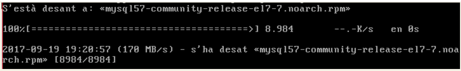  

Per instal·lar el paquet hem d'escriure:  
`yum localinstall mysql57-community-release-el7-7.noarch.rpm`  
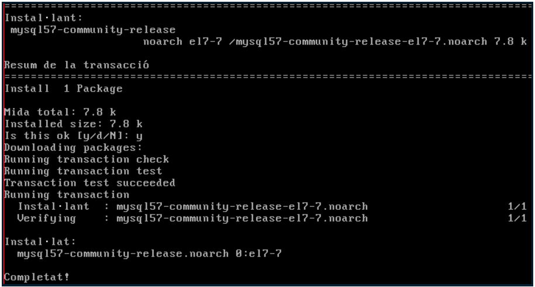  

Per verificar que el repositori s'ha afegit correctament:  
`yum repolist enabled | grep "mysql.*-community.*"`  
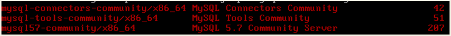  

Seguidament instal·lem l'última versió de MySQL  
`yum install mysql-community-server`  
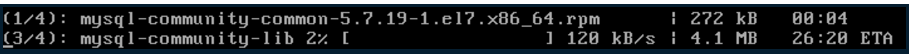  

Per començar el MySQL Server, un cop s'ha instal·lat tot  
`service mysqld start`  

Per comprovar l'estat del servidor  
`service mysqld status`  
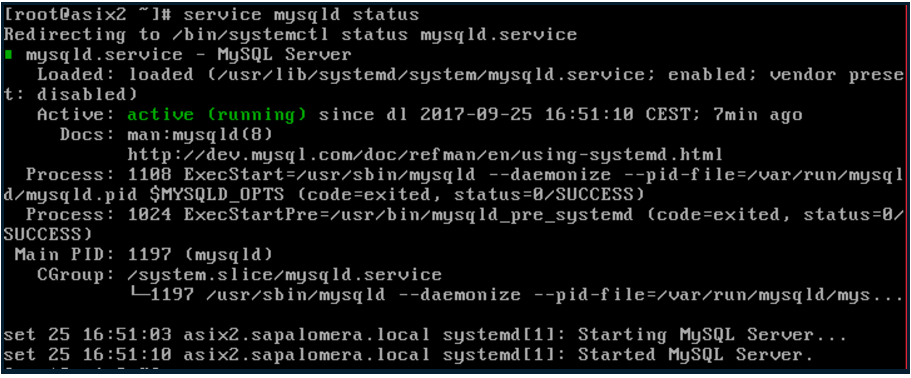  

Per acabar, verifiquem la versió del MySQL  
`mysql --version`  
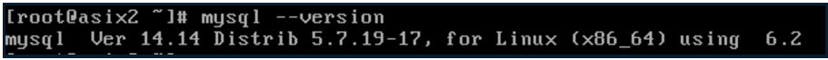  

Actualitzar MySQL via YUM  
`yum update mysql-server`  
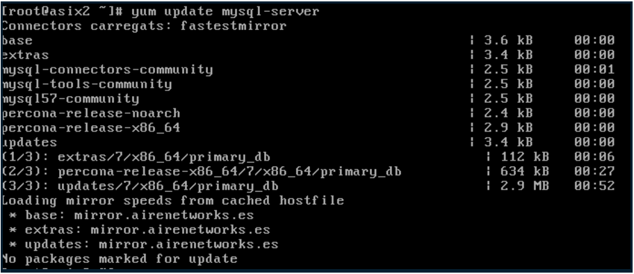  

Si hi ha noves actualitzacions per MySQL, s'instal·laran automàticament.  

## **Preguntes a respondre** ##
1. Un cop realitzada la instal·lació realitza una securització de la mateixa. Quin programa realitza aquesta tasca? Realitza una securització de la instal·lació indicant que la contrasenya de root sigui patata.

Abans de realitzar una securització del MySQL, Mysql 5.7 o superior generen una contrasenya aleatòria temporal quan s'instal·la  
`grep 'temporary password' /var/log/mysqld.log`  
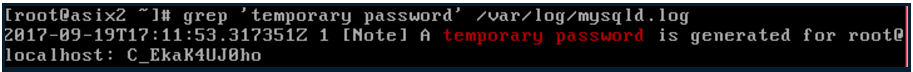  

Un cop sabem la contrasenya temporal, introduïm la comanda per fer una securització del MySQL  
`mysql_secure_installation`  
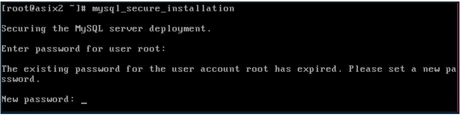  
Pass: *P@ssw0rd*  
  

Connectar-se al servidor MySQL posant un usuari i contrasenya  
`mysql -u root -p`  
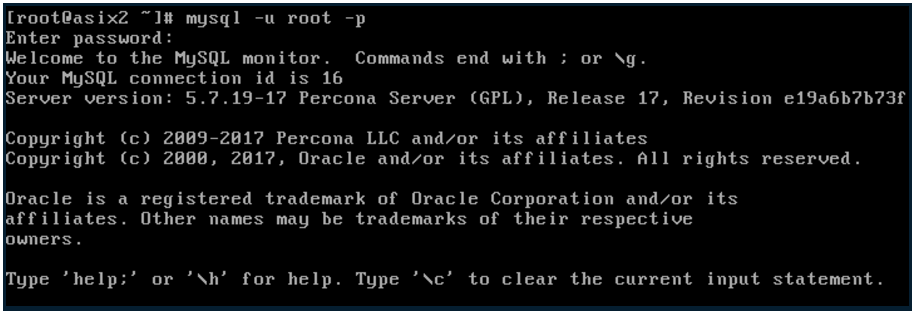  

No ens deixa posar la contrasenya *patata* perquè no compleix els requisits de la política de contrasenyes, per tant l'hem de modificar.  
Entrem al mysql i posem `SHOW VARIABLES LIKE 'validate_password%';` perquè ens mostri les variables que hi han que comencen en forma de validar la contrasenya.   
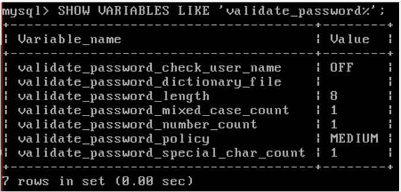  

A continuació modifiquem la variable de longitud amb: `SET GLOBAL validate_password_length=4;`  
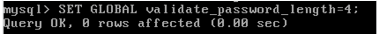  
I la variable de policy la canviem a *baix* amb: `SET GLOBAL validate_password_policy=LOW;`  
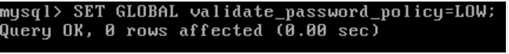  
A continuació tornem a veure les variables en quin estat estan amb el `SHOW VARIABLES LIKE 'validate_password%';`  
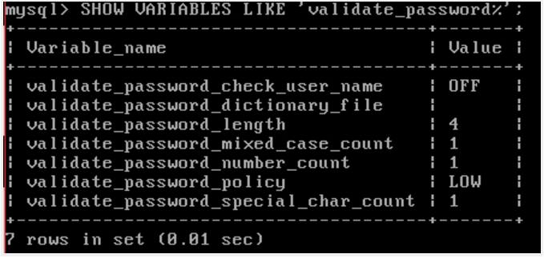  
Un cop realitzats aquests canvis, ja podem tornar a fer una securització per canviar la contrasenya a ***patata***
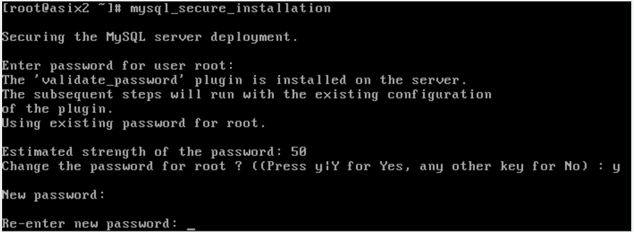  
Li donem a **sí** a totes les preguntes fins que acabi.  
*El programa que realitza aquesta securització és el **mysql_secure_installation**.*

2. Quines són les instruccions per arrancar / verificar status / apagar servei de la base de dades de Percona Server.

Per arrancar el Percona Server escrivim  
`service mysql start`  
Per verificar l'estat del servidor  
`service mysql status`  
Per apagar el servidor  
`service mysql stop`  

3. A on es troba i quin nom rep el fitxer de configuració del SGBD Percona Server?

El fitxer de configuració del SGBD Percona Server es diu **my.cnf** i es troba a `/etc/my.cnf`.
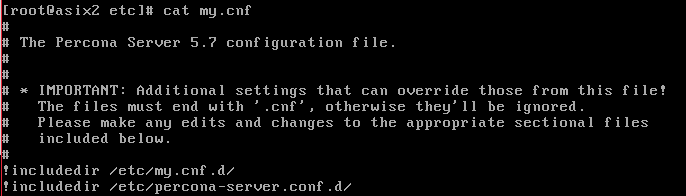

4. A on es troben físicament els fitxers de dades (per defecte)

Es trobem al directori `/var/lib/mysql` per defecte. Es pot saber introduint `select @@datadir;`.
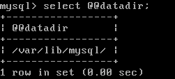

5. Crea un usuari anomenat **asix** en el sistema operatiu i en SGBD de tal manera que aquest usuari del sistema operatiu no hagi d'introduir l'usuari i password cada vegada que cridem al client mysql?
  * http://dev.mysql.com/doc/refman/5.7/en/password-security-user.html
  * Usuari SO-→ asix / patata
  * Usuari MySQL → asix / patata

Primer de tot, creem l'usuari asix en el sistema operatiu  

Un cop creat l'usuari, hem de canviar la política de les contrasenyes perque es pugui posar **patata**.  
Per canviar-ho s'ha d'anar a `/etc/security` i editar el fitxer `pwquality.cnf`.  
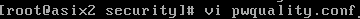

S'ha de canviar la longitud mínima per un altre.  
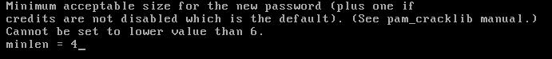

Un cop fet, amb la comanda `passwd` posem que la contrasenya sigui **patata**.  
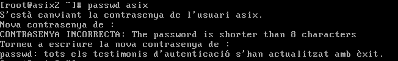  
**Nota:** Encara que digues incorrecte la primera vegada, a la segona ho ha fet.  
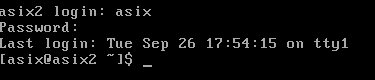

Ara que l'usuari **asix** ja està creat, creem l'usuari pel MYSQL, però abans hem de canviar la política de les contrasenyes del MYSQL amb el `SHOW VARIABLES LIKE 'validate_password%;`. Quan estiguin canviades, creem l'usuari amb el `CREATE USER`.
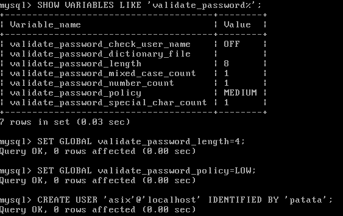

Ja tenim l'usuari **asix** creat al MYSQL, però cada vegada que volem entrar hem de posar l'usuari i contrasenya. Per treure això, hem de crear un fitxer anomenat `.my.cnf` a la carpeta de l'usuari.  

Dins el fitxer escrivim el següent:  
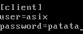

Atorguem permisos al fitxer i un cop fet tot això podrem entrar dins el MYSQL només escrivint `mysql`.
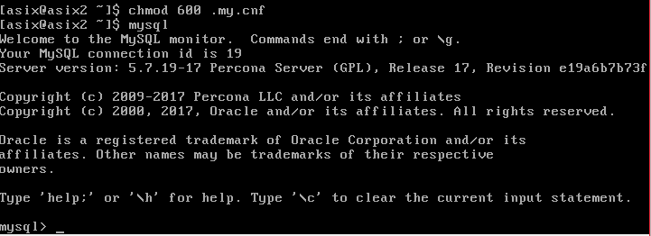

6.	El servei de MySQL (mysqld) escolta al port 3306. Quina modificació/passos caldrien fer per canviar aquest port a 33306 per exemple? Important: No realitzis els canvis. Només indica els passos que faries.

Per canviar el port, hem d’editar el fitxer `/etc/my.cnf`, que és el Global Mysql Configuration File. Un cop dins, afegim el port 33306, `port=33306`. Guardem els canvis i reiniciem el servidor.  
  
  
---
  
  
# **PART II - INSTAL·LACIÓ SGBD MongoDB (màx. 3 punts)** #

## ENUNCIAT ##
Partint d'una màquina CentOS 7 minimal proporcionada pel professor realitza la instal·lació d'un SGBD NoSQL MongoDB (última versió).

## ENLLAÇOS ##
**Documentació oficial d’instal·lació  MongoDB (RedHat 7)**  
<https://docs.mongodb.com/master/tutorial/install-mongodb-on-red-hat/>

## **Documentació per la instal·lació** ##
Per instal·lar MongoDB, primer hem de configurar el sistema de gestió de paquets via yum. Per fer-ho hem de crear un fitxer a  
`/etc/yum.repos.d/mongodb-org-3.4.repo`  
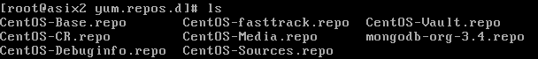

Per aconseguir l’última versió estable de MongoDB, al fitxer escrivim  
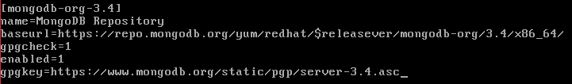

Instal·lem els paquets MongoDB i les eines associades  
`sudo yum install -y mongodb-org`
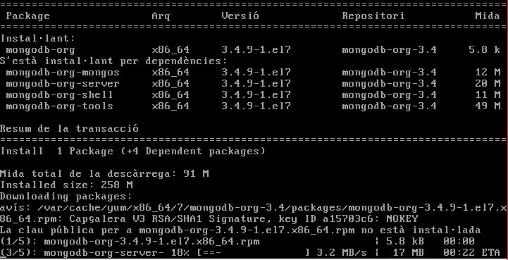

Hem de configurar el SELinux perquè els límits dels recursos del sistema en sistemes operatius Unix poden afectar negativament al funcionament. Es pot configurar de 3 maneres diferents.  

* Una manera és habilitant els ports amb la comanda `semanage port -a -t mongod_port_t -p tcp 27017`. Però el problema que es troba és que no reconeix la comanda `semanage`.
  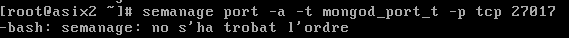

  Per instal·lar `semanage` hem de posar una sèrie de comandes.

  `yum provides /usr/sbin/semanage`  
  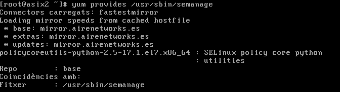

  Hem d’instal·lar `policycoreutils-python-2.2.5-11.el7_0.1.x86_64` per aconseguir la comanda `semanage`.  
  `yum install policycoreutils-python`
  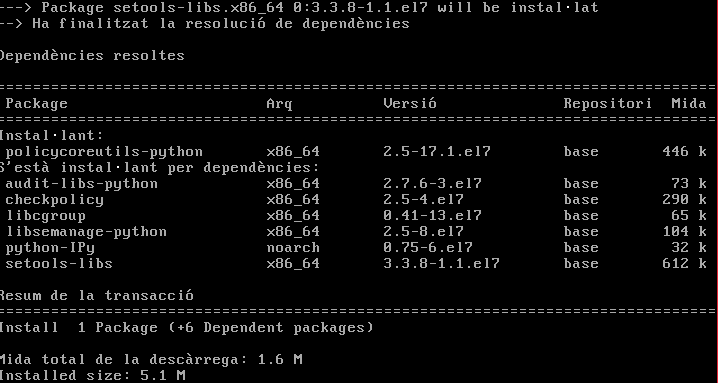  
  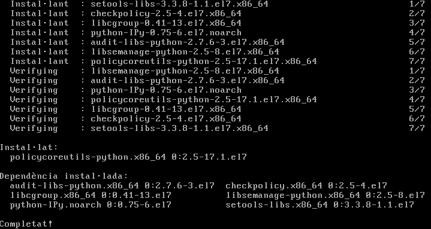

  Un cop instal·lat ja es pot utilitzar la comanda `semanage`.  
  `semanage port -a -t mongod_port_t -p tcp 27017`  
  **Nota:** un problema que es pot tenir és que falli la comanda. Al reiniciar el sistema no hauria d’haver-hi cap problema.

* Un altre és editant el fitxer `/etc/selinux/config`. Canviem la línia de `SELINUX=enforcing` a `SELINUX=disabled`.  
    
  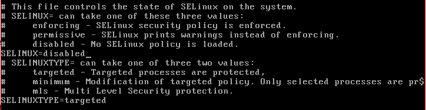

* L’altre és també  editant el fitxer `/etc/selinux/config`. Canviem la línia de `SELINUX=enforcing` a `SELINUX=permissive`.

  El servidor podrà iniciar sense cap problema.  
  **Nota:** un dels problemes que es pot tenir és que la primera vegada que es vulgui entrar falli.  
  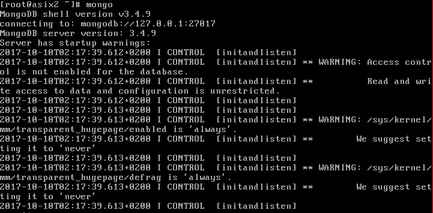

Per iniciar el servidor  
`sudo service mongod start`  
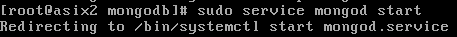

Per comprovar que MongoDB ha iniciat correctament hem de mirar el fitxer `/var/log/mongodb/mongod.log`. Ens hem de posicionar a l’última línia que diu `[initandlisten] waiting for connections on port <port>`, on el port és el que està configurat per defecte a `/etc/mongod.conf, 27017`.  
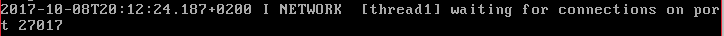

Opcionalment, per assegurar-se que MongoDB iniciï després d’un reinici de servidor  
`sudo chkconfig mongod on`  
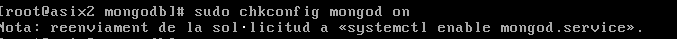

Per apagar el servidor  
`sudo service mongod stop`  
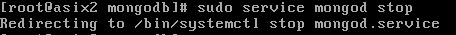

Per reiniciar el servidor  
`sudo service mongod restart`

Perquè el servidor MongoDB comenci quan s'engega el servidor:  
`systemctl enable mongod.service`

