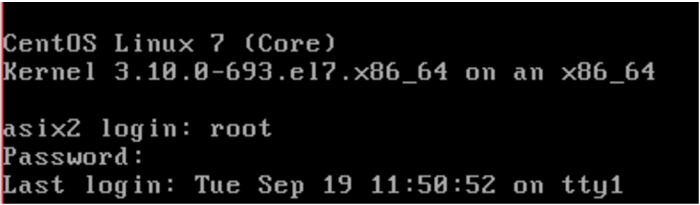

# **Part I - INSTAL·LACIÓ SGBD MySQL Percona** #

## ENUNCIAT ##
Partint d'una màquina CentOS 7 minimal proporcionada pel professor realitza la instal·lació d'un SGBD Percona Server mitjançant el gestor de paquets YUM.

## ENLLAÇOS ##
**Percona Server 5.7 Doc**
<http://www.percona.com/doc/percona-server/5.7>

**Instal·lació Percona Server 5.7via YUM Repository**
<http://www.percona.com/doc/percona-server/5.7/installation/yum_repo.html>

**Instal·lació MySQL via YUM Repository**
<http://www.tecmint.com/install-latest-mysql-on-rhel-centos-and-fedora/>

## **Documentació per la instal·lació** ##
`codigo`

## **Preguntes a respondre** ##
1. Un cop realitzada la instal·lació realitza una securització de la mateixa. Quin programa realitza aquesta tasca? Realitza una securització de la instal·lació indicant que la contrasenya de root sigui patata.
2. Quines són les instruccions per arrancar / verificar status / apagar servei de la base de dades de Percona Server.
3. A on es troba i quin nom rep el fitxer de configuració del SGBD Percona Server?
4. A on es troben físicament els fitxers de dades (per defecte)
5. Crea un usuari anomenat asix en el sistema operatiu i en SGBD de tal manera que aquest usuari del sistema operatiu no hagi d'introduir l'usuari i password cada vegada que cridem al client mysql?
> http://dev.mysql.com/doc/refman/5.7/en/password-security-user.html  Usuari SO-→ asix / patata  Usuari MySQL → asix / patata
6.	El servei de MySQL (mysqld) escolta al port 3306. Quina modificació/passos caldrien fer per canviar aquest port a 33306 per exemple? Important: No realitzis els canvis. Només indica els passos que faries.
