#### Sara Caparrós Torres i Patricia López López (ASIX 2 - Curs 2017/18) ####
# CONFIGURACIÓ SGBD

## ENUNCIAT ##

Partint del SGBD Percona Server instal·lat en l'activitat anterior realitza aquests canvis en el fitxer de configuració.  


## REALITZA LES SEGÜENTS TASQUES DE CONFIGURACIÓ i COMPROVACIÓ DE LOGS ##

1.	Crea un fitxer de configuració a on:  
    *	Canvia el port per defecte de connexió al 3011.  
      En el fitxer de configuració de `/etc/my.cnf` afegim el port.
      
    *	Quins són els logs activats per defecte? Com ho has fet per comprovar-ho?  
    Podem veure alguns logs dintre del MYSQl amb la comanda `SHOW VARIABLES LIKE 'log%;`.  
      
    Dintre del fitxer `/etc/percona-server.cnf.d/mysqld.cnf`trobem el log d'errors.  
    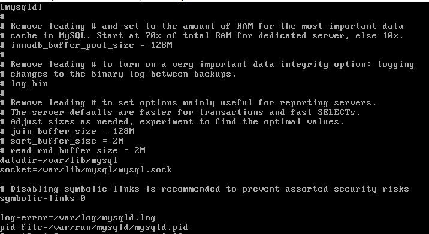  
    En `/var/log` el podem trobar.  
    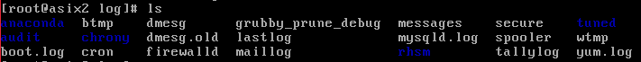  
    *	Activa si no ho estan i indica les configuracions necessàries per activar-los. Indica les rutes dels fitxers de log de Binary, Slow Query i General. Quins paràmetres has modificat?  
    **General log**  
    Editem el fitxer `/etc/my.cnf`.  
      
    Creem una carpeta a `/var/log`.
    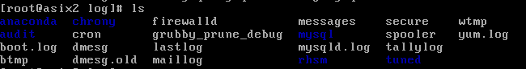  
    Canviem els permisos de propietari `chown mysql:mysql /var/log/mysql`.
      
    Un cop fet reiniciem el servidor `service mysql restart`.  
    Podem comprovar si fa bé el logs, per exemple amb un `select`.  
    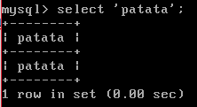  
    Mirem el fitxer `/var/log/mysql/mysql_general.log`.
    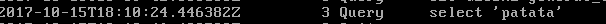  
    **Binary log**  
    Afegim al fitxer `/etc/my.cnf`:   
    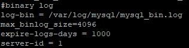  
    Reiniciem el servidor amb `service mysql restart`.  
    Podem veure com s'han creat els fitxers a `/var/log/mysql`.  
    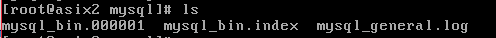  
    **Slow query log**  
    Afegim al fitxer `/etc/my.cnf`:  
    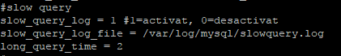  
    Reiniciem el servidor amb `service mysql restart`.  
    El nostre fitxer `my.cnf` quedaria així.  
    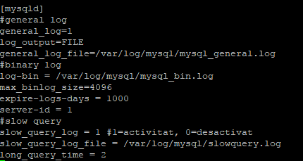  
    Si anem a `/var/log/mysql` veurem els fitxers de logs creats.
      

2.	Comprova l'estat de les opcions de log que has utilitzat mitjançant una sessió de mysql client.  
        Exemple: (`mysql> SHOW GLOBAL VARIABLES LIKE '%log'`)  
    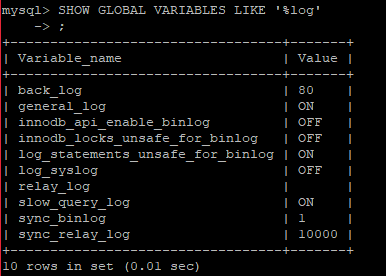  
    Per veure el log del binari escrivim `SHOW VARIABLES LIKE ‘log_bin’;`.  
    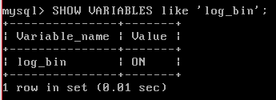  
    Els 3 logs que hem implementat estan activats.

3.	Modifica el fitxer de configuració i desactiva els logs de binary, slow query i genral. **Nota:** Simplement desactiva'ls no esborris altres paràmetres com la ruta dels fitxers, etc...  
Posem a 0 el `general_log` i `slow_query_log`.  
Per desactivar el binari afegim un `skip-` davant de `log_bin = mysql-bin`.  
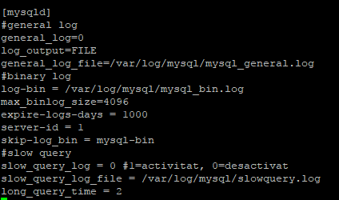  
Fem un `service mysql restart`.  
Comprovem que estiguin desactivats.  
  
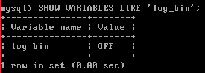  

4.	Activa els logs en temps d'execució mitjançant la sentència SET GLOBAL. També canvia el destí de log general a una taula (paràmetre `log_output`). Quines són les sentències que has utilitzat? A quina taula registres els logs general?  
Activem els logs amb la comanda `SET GLOBAL`.  
General_log:  
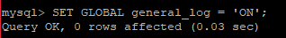  
Slow_query_log:  
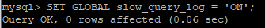  
Comprovem que s'hagin desactivat.  
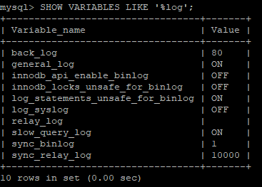  
Log_bin:  
  
En el binari ens dona un error perque la variable `log_bin` és només de lectura.  
Segons la documentació de [MYSQL](https://dev.mysql.com/doc/refman/5.5/en/replication-options-binary-log.html#option_mysqld_log-bin), es pot canviar l’efecte de `log_bin` canviant un altre variable, `sql_log_bin`.  
`SET SQL_LOB_BIN = ‘x’;`  
Activarà o desactivarà tots els events binaris de teva sessió.  
`SET GLOBAL SQL_LOG_BIN = ‘x’;`
Activarà o desactivarà tots els events binaris de totes les sessions.  
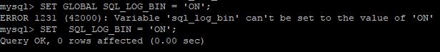  
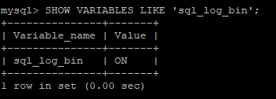  
Per canviar el destí del `general_log` a una taula escrivim:  
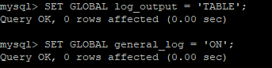  
Els logs els podrem trobar a la taula `mysql.general_log`.  
Per veure els logs escrivim el següent:  
`use mysql;`  
`SELECT * FROM general_log;`  
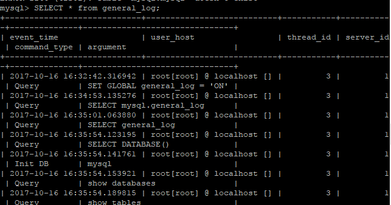  
S’han registrat a la taula `mysql.general_log`.  

5.	Carrega la BD Sakila localitzada a la web de  
    1.	Descarrega't el fitxer sakila-schema.sql del Moodle.  
    2.	Carrega la BD dins del MySQL utilitzant la sentència:  
    `mysql> SOURCE <ruta_fitxer>/sakila-schema.sql;`  
    Baixem el fitxer `sakila-schema.sql`.  
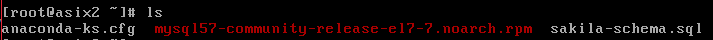  
Afegim la base de dades dins el MYSQL  
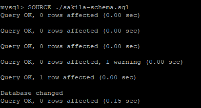  
6.	Compte el número de sentències CREATE TABLE dins del general log mitjançant:  
		`mysql> SELECT COUNT(*)`  
				`FROM mysql.general_log`  
			  `WHERE argument LIKE 'CREATE TABLE%';`  
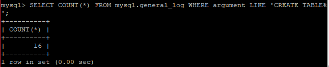  
7.	 Executa una query mitjançant la funció SLEEP(11) per tal que es guardi en el log de Slow Query. Mostra el contingut del log demostrant-ho.  
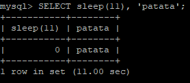  
Mostrem el contingut del log `/var/log/mysql/slowquery.log`.  
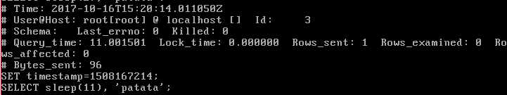  
**NOTA:** el slow query ha d’estar activat  

8.	Assegura't que el *Binary Log* estigui activat i borra tots els logs anteriors mitjançant la sentència RESET MASTER.  
Ens assegurem de que el log binari estigui activat.  
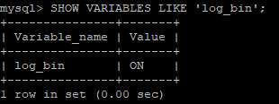  
Borrem tots els logs binaris amb la comanda `RESET MASTER`.  
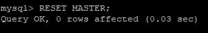  
Comprovem que la comanda ha funcionat.  
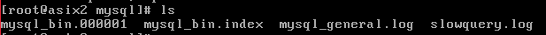  


 


 
 
 
 
*	Crea i borra una base de dades anomenada foo. Utilitza les sentències:  
        `mysql> CREATE DATABASE foo;`  
		`mysql> DROP DATABASE foo;`  
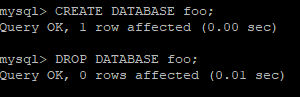  
*	Mitjançant la sentència `SHOW BINLOG EVENTS` llista els esdeveniments i comprova les sentències anteriors en quin fitxer de log estan.  
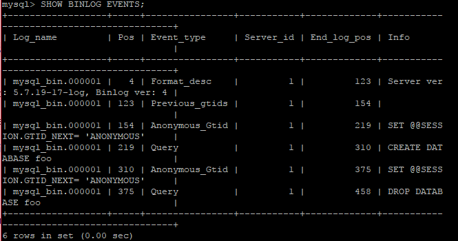 
Estan al fitxer `mysql_bin.000001` a `/var/log/mysql`.  
*	Realitza un Rotate log mitjançant la sentència `FLUSH LOGS`  
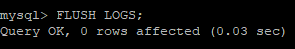  
*	Crea i borra una altra base de dades com l'exemple anterior del `foo`. Però en aquest cas anomena la base de dades `bar`  
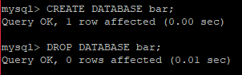  
*	Llista tots els fitxers de log i els últims canvis mitjançant la sentència SHOW. Quina sentència has utilitzat? Mostra'n el resultat.  
Podem veure tots els fitxers de log amb `SHOW MASTER LOGS`   
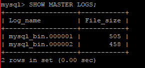 
Podem agafar el segon fitxer binari i veure el seu contingut amb la comanda `SHOW BINLOG EVENTS IN ‘mysql_bin.000002’;`.  
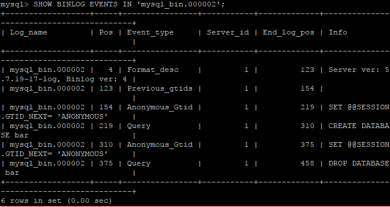 

*	Borra el primer binary log. Quina sentència has utilitzat?  
Per esborrar un log s’ha d’utilitzar la comanda `PURGE`, on es pot esborrar fins a un log o una serie de logs abans d’una data donada. Esborrem el primer fitxer binari.  
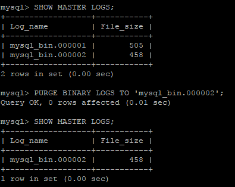 
*	Utilitza el programa `mysqlbinlog` per mostrar el fitxer *mysql-bin.000002*  
    *	Quin és el seu contingut?  
    Mostra les execucions que hem fet al MYSQL, `CREATE TABLE bar;` i `DROP TABLE bar;`.    
    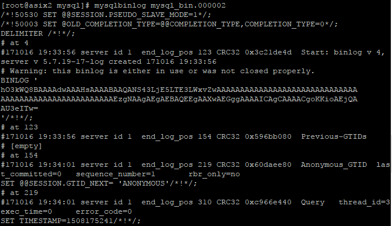  
    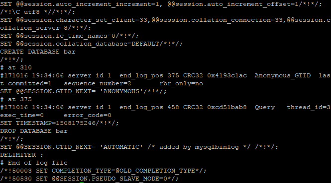  
    *	Quin número d'esdeveniment ha sigut el de la creació de la base de dades bar?  
    El número d’esdeveniment de la creació de la base de dades bar ha sigut el 219.  
     

## CONFIGURACIÓ DEL SERVIDOR PERCONA SERVER PER REALITZAR CONNEXIONS SEGURES SOBRE SSL. ##  
Primer de tot hem de crear els certificats i les claus SSL.  
A continuació estan totes les comandes i seguidament estan les captures de pantalla amb les comprovacions.  
  
Comandes:  
```
\# Creem un entorn net  
rm -rf newcerts  
mkdir newcerts && cd newcerts  
  
\# Creem el certificat CA  
openssl genrsa 2048 > ca-key.pem  
openssl req -new -x509 -nodes -days 3600 \  
        -key ca-key.pem -out ca.pem  

\# Creem els certificats del server, esborrem la frase de pas (contrasenya) i iniciem sessió  
\# server-cert.pem = public key, server-key.pem = private key  
openssl req -newkey rsa:2048 -days 3600 \  
        -nodes -keyout server-key.pem -out server-req.pem  
openssl rsa -in server-key.pem -out server-key.pem  
openssl x509 -req -in server-req.pem -days 3600 \  
        -CA ca.pem -CAkey ca-key.pem -set_serial 01 -out server-cert.pem  
  
\# Creem els certificats del client, esborrem la frase de pas (contrasenya) i iniciem sessió  
\# client-cert.pem = public key, client-key.pem = private key  
openssl req -newkey rsa:2048 -days 3600 \  
        -nodes -keyout client-key.pem -out client-req.pem  
openssl rsa -in client-key.pem -out client-key.pem  
openssl x509 -req -in client-req.pem -days 3600 \  
        -CA ca.pem -CAkey ca-key.pem -set_serial 01 -out client-cert.pem  
```
  
Després de generar els certificats, els verifiquem:  
`openssl verify -CAfile ca.pem server-cert.pem client-cert.pem`  
  
Captures de pantalla:  
  
  
  
  

Seguidament configurem el server. Començem editant el fitxer **/etc/my.cnf** afegint:  
```
[mysqld]  
ssl-ca=ca.pem  
ssl-cert=server-cert.pem  
ssl-key=server-key.pem  
```
  
Creem un usuari el SSL estigui requerit:  
  
*usuari: ssluser*  
*pass: P@ssw0rd*  
  
Per iniciar sessió amb l’usuari que te el SSL requerit (iniciem sessió com sempre, però afegim al final: `--ssl-mode=REQUIRED` ), sinó et diu que té l’accés denegat.  
  
Per comprovar que funciona el xifrat, podem fer:  
- `\s`  
  
- `STATUS`  
  
- `SHOW SESSION STATUS LIKE 'Ssl_cipher';`  
  
