**Sara Caparrós Torres i Patricia López López (ASIX 2 - Curs 2017/18)**
# ACTIVITAT Storage Engines MySQL #

## ENUNCIAT ##

Partint d'una màquina CentOS 7 amb el Percona Server 5.7 instal·lat realitza els següents apartats a on es tracten els diferents Storage Engines que conté el MySQL i en conseqüència el Percona Server.


## Activitat 1. REALITZA I/O RESPON ELS SEGÜENTS APARTATS ##

1.	Indica quins són els motors d’emmagatzematge que pots utilitzar (quins estan actius)? Mostra al comanda utilitzada i el resultat d’aquesta.  
  
Amb la comanda `SHOW ENGINES` podem veure quins motors d’emmagatzematge te-nim.  
Per veure els camps ordenats podem posar `SHOW EGINES\G;`  

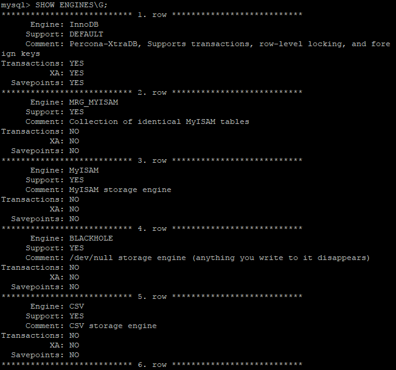  
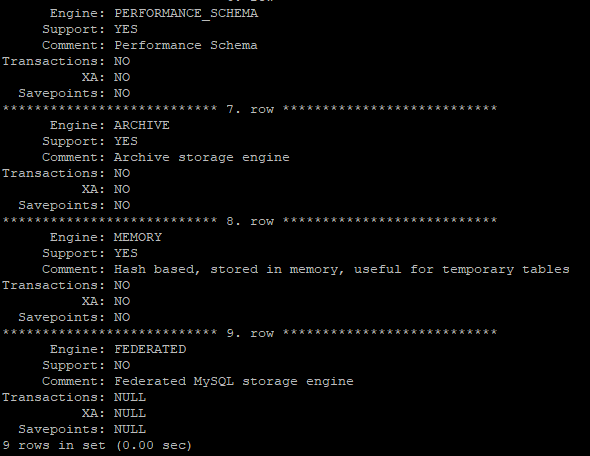  

El camp **Support** indica el següent:
  
| Valor | Significat |
| ---------- | ---------- |
| `YES`   | L’emmagatzematge està suportat i actiu  |
| `DEFAULT`   | Com el `YES`, a més és l’emmagatzematge per defecte  |
| `NO`   | L’emmagatzematge no està suportat  |
| `DISABLED`   | L’emmagatzematge està suportat i pero no està actiu |
  
2.	Com puc saber quin és el motor d’emmagatzematge per defecte. Mostra com canviar aquest paràmetre de tal manera que les noves taules que creem a la BD per defecte utilitzin el motor MyISAM?  
  
El motor d’emmagatzematge per defecte és el InnoDB  
  
Per canviar el valor per defecte editem el fitxer de configuració **/etc/my.cnf**  
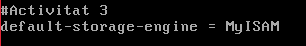  
`Service mysql restart` i comprovem que s’hagi canviat  
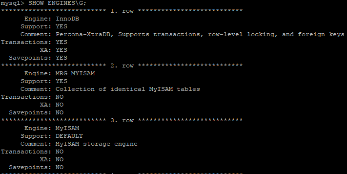  
  
3.	Com podem saber quin és el motor d'emmagatzematge per defecte?  
  
Amb la comanda `SHOW ENGINES\G` mirant el camp **Support**, ha de ser `DEFAULT`.  
  
4.	Explica els passos per instal·lar i activar l'*ENGINE MyRocks*. MyRocks és un motor d'emmagatzematge per MySQL basat en RocksDB (SGBD incrustat de tipus clau-valor).  
  
[Documentació MyRocks](https://www.percona.com/doc/percona-server/LATEST/myrocks/install.html)  

Instal·lem Percona MyRocks:  
`sudo yum install Percona-Server-rocksdb-57.x86_64`  
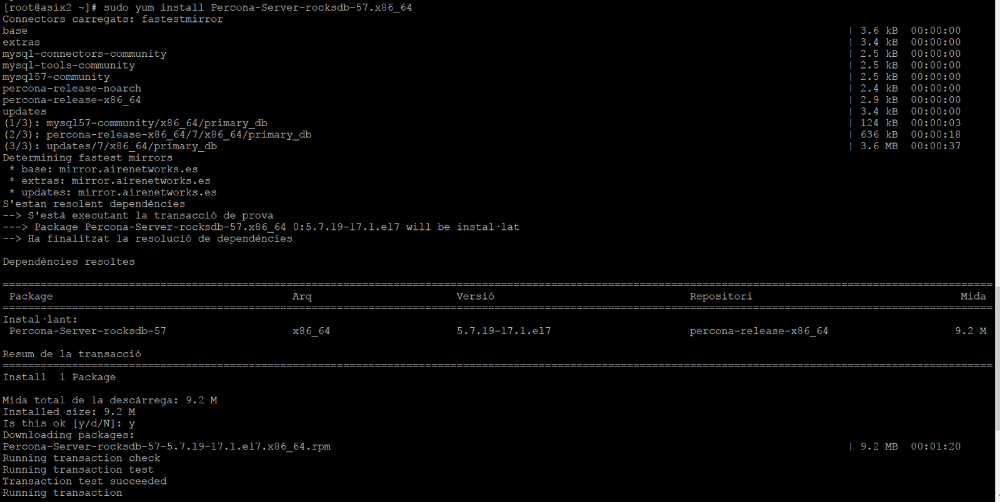  
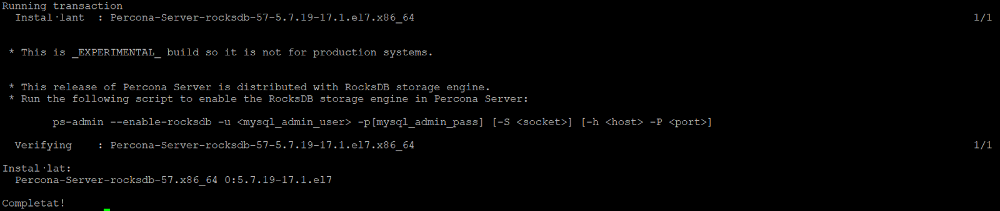  
Executem l’script `ps-admin` com a usuari root o amb sudo, i donar credencials d’usuari root de MySQL per habilitar el motor d’emmagatzematge RocksDB (My-Rocks).  
`sudo ps-admin --enable-rocksdb -u root –ppatata`  
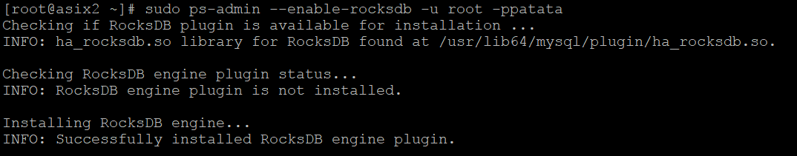  
Comprovem que està instal·lat  
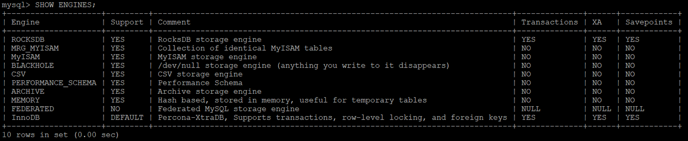  
  
```
CREATE DATABASE proves;
USE proves;
CREATE TABLE equips (
	equip_id	SMALLINT UNSIGNED PRIMARY KEY,
	nom		VARCHAR(30) NOT NULL,
	esponsor	VARCHAR(20) NOT NULL,
	director	VARCHAR(20) NOT NULL,
	pressupost	DECIMAL(11,3)
) ENGINE=Rocksdb;
```
  
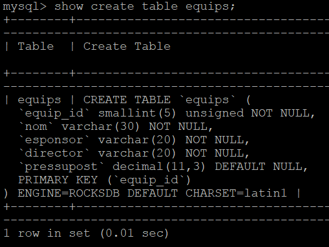  
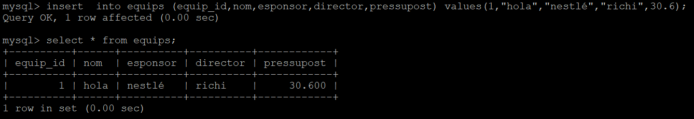  
  
5.	Importa la BD Sakila com a taules MyISAM. Fes els canvis necessaris per importar la BD Sakila perquè totes les taules siguin de tipus MyISAM.  
Mira quins són els fitxers físics que ha creat, quan ocupen i quines són les seves extensions. Mostra'n una captura de pantalla i indica què conté cada fitxer.  
  
Per canviar les taules a MyISAM, editem el fitxer sakila-schema.sql i modifiquem els EN-GINE posant MyISAM.  
```
CREATE TABLE actor (  
actor_id SMALLINT UNSIGNED NOT NULL AUTO_INCREMENT,  
first_name VARCHAR(45) NOT NULL,  
last_name VARCHAR(45) NOT NULL,  
last_update TIMESTAMP NOT NULL DEFAULT CURRENT_TIMESTAMP ON UPDATE CURRENT_TIMESTAMP,  
PRIMARY KEY  (actor_id),  
KEY idx_actor_last_name (last_name)  
)ENGINE=MyISAM DEFAULT CHARSET=utf8;  
```
Per veure el sistema d’emmagatzament més senzill, ho farem amb aquesta comanda:  
```
SELECT table_name, engine  
FROM information_schema.TABLES  
WHERE TABLE_SCHEMA='sakila';  
```
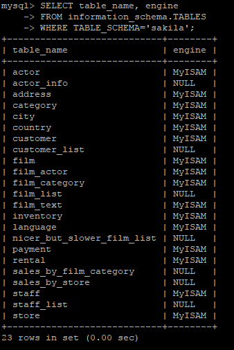  
  
Una altre manera és un cop importada (sense haver modificat l’ENGINE) es pot canviar cada taula amb:  
`ALTER TABLE nom_taula ENGINE = MYISAM;`  
L’únic problema són les Foreign Keys, que no deixen modificar-ho correctament.  
  
Al haver creat la base de dades amb MyIsam, MyIam crea 3 fitxers que es guarden física-ment per cada taula:  
* Format file (.frm): Guarda la definició de l'estructura de la taula
* Data file (.MYD): Guarda el contingut de la taula (files/dades)
* Index file (.MYI): Guarda els índexs de la taula

Aquest fitxers es troben a **/var/lib/mysq/sakila**  
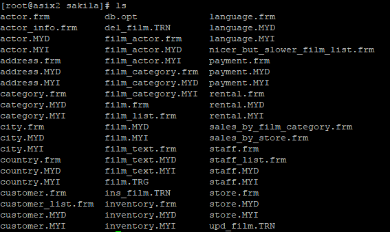  
  
per exemple si mirem el contingut del fitxer **address.frm**:  
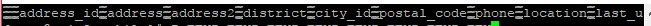  
  
El contingut del fitxer **address.MYD** i **address.MYI** no ens deixa veure-ho.  
  
Podem veure quant ocupen amb un `ls -l`  
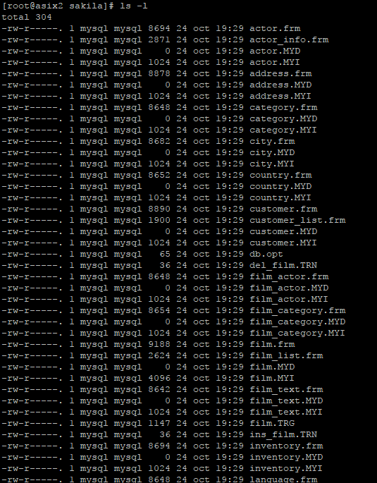  
  
## Activitat 2. INNODB part I. REALITZA ELS SEGÜENTS APARTATS. ##

1.	Importa la BD Sakila com a taules InnoDB.  

Importem la base de dades amb un `SOURCE`.  
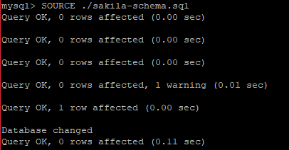  

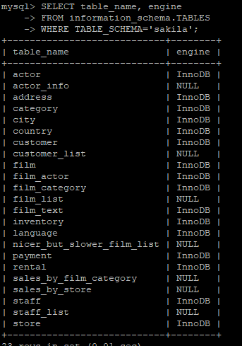  

2.	Quin/quins són els fitxers de dades? A on es troben i quin és la seva mida?  

Els fitxers que crea InnoDB es troben a `/var/lib/mysql/sakila` i són els fitxers amb extensió:  
* .ibd (integrated backup): conté dades i indexs de cada taula (només quan està activitat el `Innodb_file_per_table` , que guarda cada taula en un fitxer).  
* .ibdata1 (integrated backup data part 1): conté el diccionari de dades i l’historial de transaccions per totes les taules.  
* .frm (format): d’escriu el format de les taules, nclosos els camps i estructura de cada taula.  

Si `Innodb_file_per_table`  està activat, podem veure el següent:  
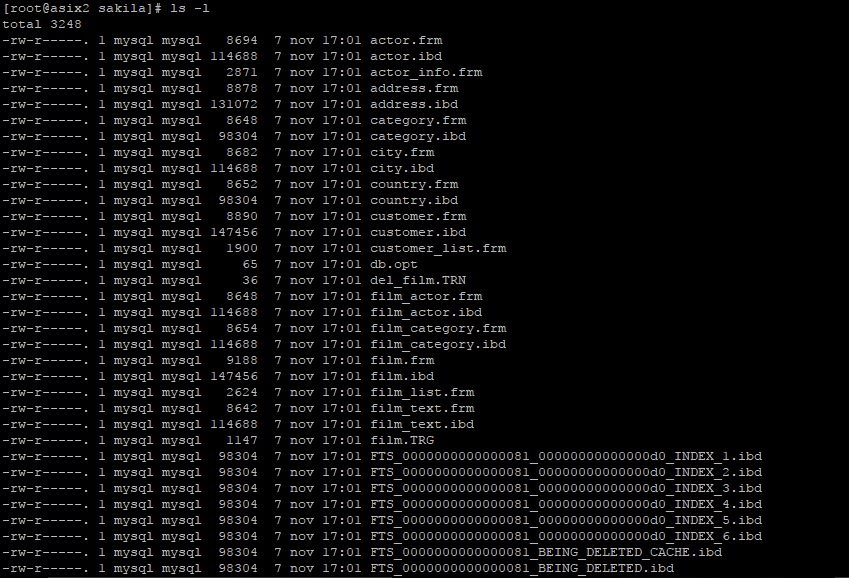  

Si `Innodb_file_per_table` està desactivat, podem veure el següent:  
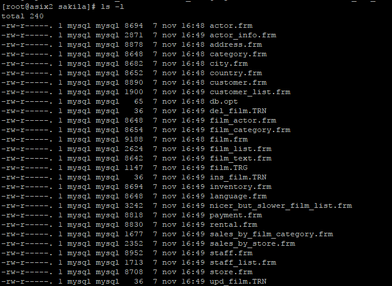  

3.	Canvia la configuració del MySQL perquè:  
	* Canviar la localització dels fitxers del tablespace de sistema per defecte a /discs-mysql/  
	
	[Documentació Tecmint](https://www.tecmint.com/change-default-mysql-mariadb-data-directory-in-linux/)  
	
	Primer creem el nou directori i li otorguem permisos.  
	`mkdir /discs-mysql`  
	`chown -R mysql:mysql /discs-mysql`
	  
	Parem el servei mysql.
	`service mysqld stop`  
	
	Copiem els fitxers de mysql al nou directori.
	`cp -R -p /var/lib/mysql/* /discs-mysql`  
	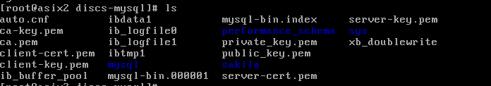  
	
	Editem el fitxer `/etc/my.cnf` per afegir el nou directori.  
	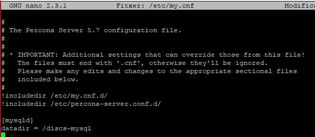  
	
	Afegim la seguretat SELinux al nou directori abans de engenar de nou el mysql.  
	`semanage fcontext -a -t mysqld_db_t "/discs-mysql(/.*)?"`  
	`restorecon -R /discs-mysql`  
	
	Engeguem el servei mysql.
	`service mysqld start`  
	
	Mirem si el directori ha canviat entrant al mysql i fent un `SELECT @@datadir;`  
	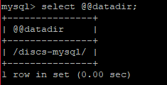  

	
	* Tinguem dos fitxers corresponents al tablespace de sistema.  
	
	[Documentació InnoDB](https://dev.mysql.com/doc/refman/5.7/en/innodb-init-startup-configuration.html)  
	
	Si anem al nou directori que hem creat veurem que només en tenim un system tablespace.  
	Volem tenir-ne 2.  
	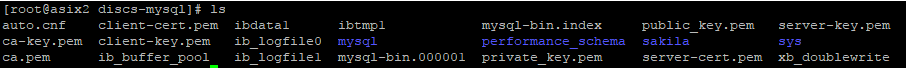  
	
	Fem un `service mysqld stop`.  
	Amb la comanda `rm -rf /discs-mysql/ib*`borrem el ibdata.  
	Editem el fitxer `/etc/my.cnf`.  
	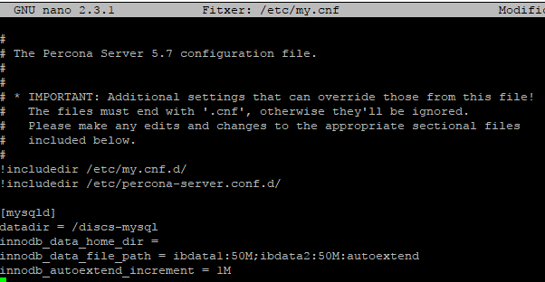  

	`service mysqld start`.  
	
	* Tots dos han de tenir la mateixa mida inicial (5MB)  
	
	Amb `innodb_data_file_path = ibdata1:5M;ibdata2:5M:autoextend` al `/etc/my.cnf` li podem dir la mida inicial.  
	
	* El tablespace ha de creixer de 1MB en 1MB.  
	
	Amb `innodb_autoextend_increment = 1M `el tablespace creixerà de 1MB en 1MB.  
	
	Ens ha creat els dos fitxers `ibdata`.  
	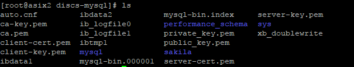  
	
	* Situa aquests fitxers (de manera relativa a la localització per defecte) en una nova localització simulant el següent:  
		* /discs-mysql/disk1/primer fitxer de dades → simularà un disc dur.   
		* /discs-mysql/disk2/segon fitxer de dades → simularà un segon disc dur.  

	Primer creem els dos fitxers, afegint-lis els mateixos permisos que té el mysql i dient-li que mysql sigui el propietari.  
	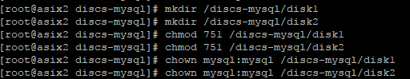  
	
	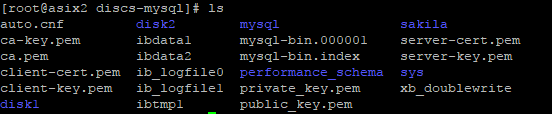  
	
	Abans de canviar res, aturem el servei `service mysqld stop`.  
	Eliminem els ibdata que tenim `rm -rf /discs-mysql/ib*`.  
	Entrem a l'arxiu `/etc/my.cnf` i afegim el directoris disk1 i disk2.  
	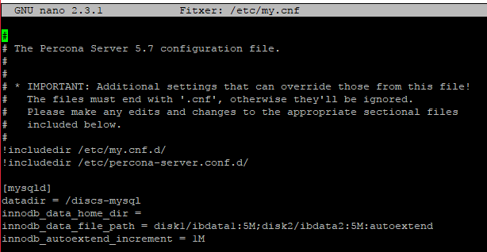  
	
	Tornem a engegar el servei `service mysqld start`.  
	Comprovem que els fitxers ibdata estiguin al directori que hem assignat.  
	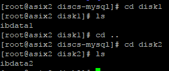  
	
4.	**Checkpoint:** Mostra al professor els canvis realitzats i que la BD continua funcionant.  


## Activitat 3. INNODB part II. REALITZA ELS SEGÜENTS APARTATS. ##

1.	Partint de l'esquema anterior configura el Percona Server perquè cada taula generi el seu propi tablespace en una carpeta anomenada ***tspaces*** *(aquesta pot estar situada a on vulgueu)*.  
	1.	Indica quins són els canvis de configuració que has realitzat.  
	2.	Després del canvi què ha passat amb els fitxers que contenien les dades de la BD de Sakila? Fes les captures necesàries per complementar la resposta.  

## Activitat 4. INNODB part III. REALITZA ELS SEGÜENTS APARTATS. ##

1.	Crea un tablespace anomenat **'ts1'** situat a `/discs-mysql/disc1/` i col·loca les taules *actor*, *address* i *category* de la BD Sakila.  
2.	Crea un altre tablespace anomenat **'ts2'** situat a `/discs-mysql/disc2/` i col·loca-hi la resta de taules.  
3.	Comprova que pots realitzar operacions DML a les taules dels dos tablespaces.  
4.	Quines comandes i configuracions has realitzat per fer els dos apartats anteriors?  
5.	**Checkpoint:** Mostra al professor els canvis realitzats i que la BD continua funcionant  

## Activitat 5. REDOLOG. REALITZA ELS SEGÜENTS APARTATS. ##

1.	Com podem comprovar (Innodb Log Checkpointing):  

	[Documentació REDOLOG](https://www.percona.com/blog/2012/02/17/the-relationship-between-innodb-log-checkpointing-and-dirty-buffer-pool-pages/)  
	
	Utilitzem la comanda `SHOW ENGINES INNODB STATUS\G;` i busquem la secció `LOG`.  
	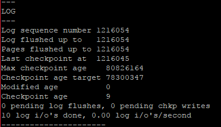  

	* LSN (Log Sequence Number)  
	
	El LSN és el log sequence number, el número 1216054.   
		
	* L'últim LSN actualitzat a disc  
	
	L’últim LSN actualitzat a disk és el 1216054.  
			
	* Quin és l'últim LSN que se li ha fet Checkpoint  
	
	L’últim LSN que se li ha fet checkpoint és el 1216054.
	 
3.	Com podem mirar el número de pàgines modificades (dirty pages)? I el número total de pàgines?  

	Utilitzem la comanda `SHOW ENGINES INNODB STATUS\G;` i busquem la secció `BUFFER POOL AND MEMORY`.  
	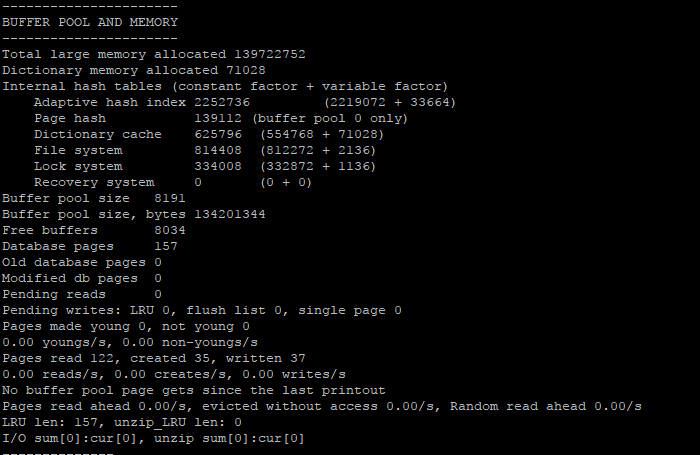  
	
	El número de pàgines modificades ens ho dona el paràmetre `Modified db pages`, que en aquest cas en tenim 0.  
	Per veure el total de les pàgines que en tenim, el paràmetre `Databses pages` ens diu 157.  
	
4.	**Checkpoint:** Mostra al professor els canvis realitzats i que la BD continua funcionant.  

## Activitat 6. Implementar BD Distribuïdes.  ##

Com s'ha vist a classe MySQL proporciona el motor d'emmagatzemament FEDERATED que té com a funció permetre l'accés remot a bases de dades MySQL en un servidor local sense utilitzar tècniques de replicació ni clustering.  
  
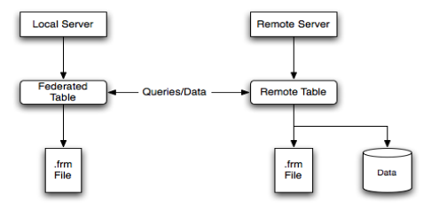  
  
1.	Prepara un Servidor Percona Server amb la BD de Sakila  
  
```
mysql -u root -ppatata
source ./sakila-schema.sql
```
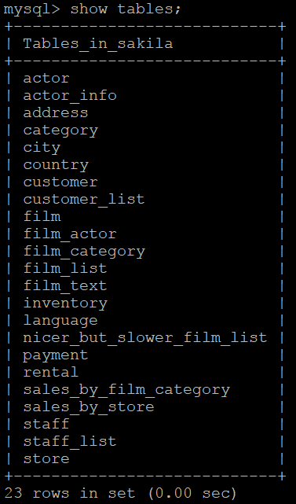  
  
2.	Prepara un segon servidor Percona Server a on hi hauran un conjunt de taules FEDERADES al primer servidor.  
3.	Per realitzar aquest link entre les dues BD podem fer-ho de dues maneres:  
	1.	Opció1: especificar TOTA la cadena de connexió a CONNECTION  
	2.	Opció2: especificar una connexió a un server a CONNECTION que prèviament s'ha creat mitjançant CREATE SERVER  
	3.	Posa un exemple de 2 taules de cada opció.  
Tingues en compte els permisos a nivell de BD i de SO així com temes de seguretat com firewalls, etc...  
	4.	Detalla quines són els passos i comandes que has hagut de realitzar en cada màquina.  
4.	**Checkpoint:** Mostra al professor la configuració que has hagut de realitzar i el seu funcionament.  

## Activitat 7. Storage Engine CSV ##  
1. Documenta i posa exemple de com utilitzar ENGINE CSV.  
  
Aquest engine guarda les dades en fitxers de text utilitzant una coma per separar cada paràmetre.  
Aquesta és una forma d’exportar les dades d’una taula molt ràpidament, i que es pot obrir amb un Excel, un Calc, etc. i fins i tot és un format que és molt senzill per “posar-ho maco” amb PowerShell o C#...
  
2.	Cal documentar els passos que has hagut de realitzar per preparar l'exemple: configuracions, instruccions DML, DDL, etc...  
```
USE proves;  
CREATE TABLE test (  
    i	INT		NOT NULL,  
    c	CHAR(10)	NOT NULL  
) ENGINE=csv;  
INSERT INTO test VALUES (1,’record one’),(2,’record two’);  
SELECT * FROM test;  
```
| i | c |
| ---------- | ---------- |
| 1 | record one |
| 2 | record two |


Dintre d’aquest estan tots els arxius, i està el test.csv  

```
[root@asix2 proves]# cd /var/lib/mysql/proves  
[root@asix2 proves]# ls  
db.opt	equips.frm	test.CSM	test.CSV	test.frm  
[root@asix2 proves]# cat test.CSV  
1,”record one”  
2,”record two”  
```
